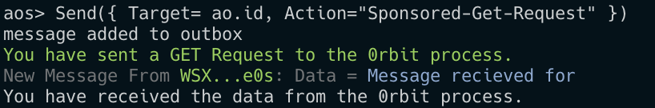

import { Callout } from 'nextra/components'

# Sponsored Get Request

<Callout type="error" emoji="️🚫">
  This is deprecated and will be removed in the future.
</Callout>

In this tutorial, we will learn how to make a GET request on `0rbit` process with the Sponsored method.

## 🔑 Prerequisites
- Understanding of the [ao](/concepts/what-is-ao) and [aos](/concepts/what-is-aos).
- aos installed on your system.
- Any Code Editor (VSCode, Sublime Text, etc)

If you are ready with the above prerequisites, 

## 🛠️ Let's Start Building 

### Initialize the Project

Create a new file named `0rbit-Get-Request.lua` in your project directory.

```bash
touch 0rbit-Get-Request.lua
```

### Initialize the Variables

```lua
local json = require("json")

_0RBIT = "BaMK1dfayo75s3q1ow6AO64UDpD9SEFbeE8xYrY2fyQ"

BASE_URL = "https://dummyjson.com/products"

ReceivedData = ReceivedData or {}
```

### Make the Request

The following code contains the Handler that will send 1 $0RBT to the `0rbit` process and make the GET request for the `BASE_URL`

```lua
Handlers.add(
    "Get-Request",
    Handlers.utils.hasMatchingTag("Action", "Sponsored-Get-Request"),
    function(msg)
        Send({
            Target = _0RBIT,
            Action = "Get-Real-Data",
            Url = BASE_URL
        })
        print(Colors.green .. "You have sent a GET Request to the 0rbit process.")
    end
)
```
Breakdown of the above code:
- `Handlers.add` is used to add a new handler to the `ao` process.
- __Get-Request__ is the name of the handler.
- `Handlers.utils.hasMatchingTag` is a function that checks if the incoming message has the matching tag same as the __Sponsored-Get-Request__.
- `function(msg)` is the function executed when the handler is called.
- `Send` is the function that takes several tags as the arguments and creates a message on the ao: 
    | __Tag__        | __Description__ |
    | :------------ | :---------: |
    | Target        |    The processId of the recipient. <br/> In this case, it's the `0RBIT` processId.    |
    | Action     | The tag that defines the handler to be called in the recipient process. <br/> In this case, it's `Get-Real-Data`    |
    | Url| The tag that contains URL to be used by the __0rbit process__ to fetch the data. |

### Receive Data

The following code contains the Handler that will receive the data from the `0rbit` process and print it.

```lua
Handlers.add(
    "Receive-Data",
    Handlers.utils.hasMatchingTag("Action", "Receive-Response"),
    function(msg)
        local res = json.decode(msg.Data)
        ReceivedData = res
        print(Colors.green .. "You have received the data from the 0rbit process.")
    end
)
```
Breakdown of the above code:
- `Handlers.add` is used to add a new handler to the `ao` process.
- __Receive-Data__ is the name of the handler.
- `Handlers.utils.hasMatchingTag` is a function that checks if the incoming message has the matching tag same as the __Receive-Response__.
- `function(msg)` is the function executed when the handler is called.
    - `json.decode` is used to decode the JSON data received.
    - `ReceivedData = res` stores the received data in the `ReceivedData` variable.

<Callout type="info" emoji="ℹ️">
    The 0rbit process always sends the data in the `string` format. 
    
    `json.decode` is used above because we know the receiving data, i.e., stringified JSON.
    
    So, you need to decode the data as per your requirements.
</Callout>

## 🏃 Run the process 

### Open your terminal 

    Open your terminal in the directory that contains `0rbit-Get-Request.lua` and start the aos.
    
    ```bash
    aos
    ```

### Load the process

    ```bash
    .load 0rbit-Get-Request.lua
    ```

### Call the Handler 

    Call the handler, who will create a request for the 0rbit process.

    ```bash
    Send({ Target= ao.id, Action="Sponsored-Get-Request" })
    ```
    <details>
    <summary>
    Upon the successful execution, you will receive the following messages in your terminal
    </summary>
    
    </details>

### Check the Data

    To check the data stored in the `ReceivedData` variable, run the following command:

    ```bash
    ReceivedData
    ```

    <details>
    <summary>
    Upon the successful execution, you will receive the JSON data in your terminal:
    </summary>
        ```json
            {
            limit = 30,
            products = {
                {
                stock = 94,
                price = 549,
                brand = "Apple",
                images = { "https://cdn.dummyjson.com/product-images/1/1.jpg", "https://cdn.dummyjson.com/product-images/1/2.jpg", "https://cdn.dummyjson.com/product-images/1/3.jpg", "https://cdn.dummyjson.com/product-images/1/4.jpg", "https://cdn.dummyjson.com/product-images/1/thumbnail.jpg" },
                title = "iPhone 9",
                id = 1,
                thumbnail = "https://cdn.dummyjson.com/product-images/1/thumbnail.jpg",
                category = "smartphones",
                description = "An apple mobile which is nothing like apple",
                rating = 4.69,
                discountPercentage = 12.96
                },
                //...
                {
                stock = 54,
                price = 30,
                brand = "Golden",
                images = { "https://cdn.dummyjson.com/product-images/30/1.jpg", "https://cdn.dummyjson.com/product-images/30/2.jpg", "https://cdn.dummyjson.com/product-images/30/3.jpg", "https://cdn.dummyjson.com/product-images/30/thumbnail.jpg" },
                title = "Key Holder",
                id = 30,
                thumbnail = "https://cdn.dummyjson.com/product-images/30/thumbnail.jpg",
                category = "home-decoration",
                description = "Attractive DesignMetallic materialFour key hooksReliable & DurablePremium Quality",
                rating = 4.92,
                discountPercentage = 2.92
                }
            },
            total = 100,
            skip = 0
            }
        ```
    </details>

---
___Voila! You have successfully made your first GET request on the 0rbit process. 🎉___

> You can find the complete code here:
> 
> https://github.com/0rbit-co/examples/blob/main/Sponsored-Get-Request.lua
