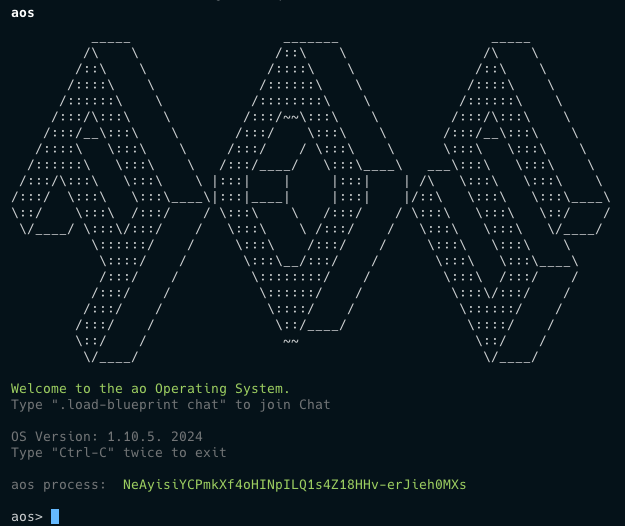
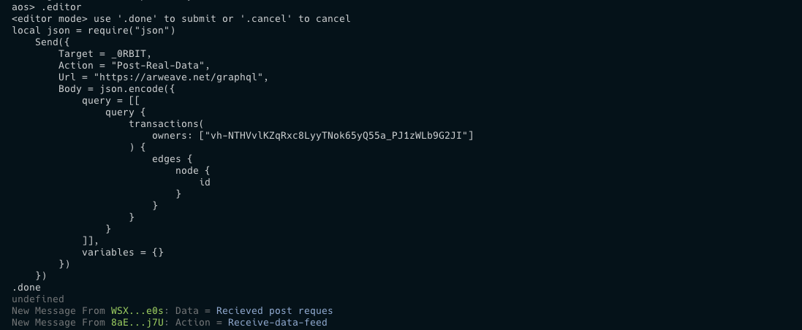

import { Steps } from 'nextra/components'
import Image from 'next/image'

# Your First Post Request

Create your first `Post` request using `0rbit`

## Prerequisite

- Basic understanding of `ao`
- Basic understanding of `Arweave`

## Install AOS
<Steps>

### Install __AOS__ 
    ```bash
    npm i -g https://get_ao.g8way.io
    ```
    AOS is the environment that helps to create and compile `ao` process.

### Initialize the AOS
    ```bash
    aos
    ```
    This will create an `ao` process for your local machine to interact with the `ao` processes.

    

</Steps>


## AOS Editor
<Steps>

### Start the editor
    ```bash
    .editor
    ```
    This will start the editor for you to write the commands to interact with the `ao` processes.

### Command to interact with the `ao` processes
    #### Create a variable
    ```bash
    _0RBIT= "WSXUI2JjYUldJ7CKq9wE1MGwXs-ldzlUlHOQszwQe0s"
    ```
    This will create a variable `_0RBIT` and assign the value of the process ID of the __0rbit's GET `ao` process__.

    #### Create a `Post` request
    ```bash
    local json = require("json")
    Send({
        Target = _0RBIT,
        Action = "Post-Real-Data",
        Url = "https://arweave.net/graphql",
        Body = json.encode({
            query = [[
                query {
                    transactions(
                        owners: ["vh-NTHVvlKZqRxc8LyyTNok65yQ55a_PJ1zWLb9G2JI"]
                    ) {
                        edges {
                            node {
                                id
                            }
                        }
                    }
                }
            ]],
            variables = {}
        })
    })
    ```
    In this command:
    - `json` is a library that is required to encode the data into json format.
    - `TARGET` is the process ID of the ao process user wants to interact with, which in this case is __0rbit's GET `ao` process__.
    - `Action` is the specific tag required by __0rbit__ to perform the `Post` request.
    - `Url` is the Http URL where the request will be sent.
    - `Body` is the data that will be sent to the Http URL.
    
    This will create a `Post` request and send it to the __0rbit's GET `ao` process__.

### Send the command
    ```bash
    .done
    ```
    This will end your editor session, compile the commands and execute it.

### Check the Inbox
    After sending the request, you can check the inbox of your `ao` process to see the response from the __0rbit__.

    Just type the following command in the terminal:
    ```bash
    #Inbox
    ```
    For this particular example, the response from the __0rbit__ will be a number of products.

    <details>
    <summary>At last your terminal will look like this👇🏻</summary>
    #### It has received the response from the __0rbit__.
    
    </details>

</Steps>

> Voila! You have successfully created your first `Post` request to the __0rbit__. 🎉🎉

