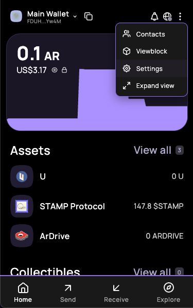
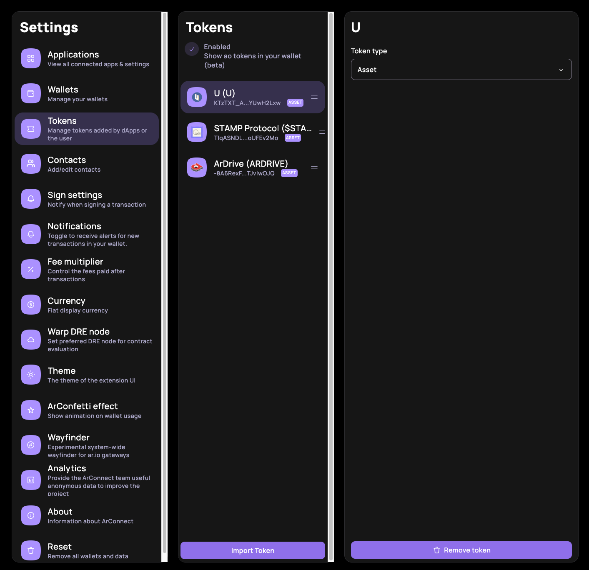
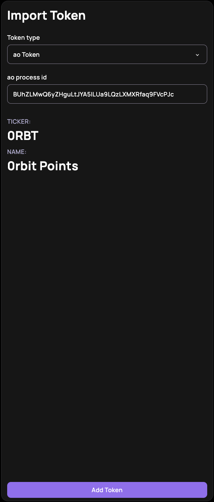
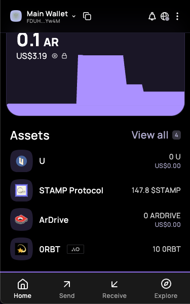

import { Steps, Callout } from 'nextra/components'

# $0RBT

`$0RBT` is the token used to pay for using the 0rbit network.

The processId for the 0RBT is [BUhZLMwQ6yZHguLtJYA5lLUa9LQzLXMXRfaq9FVcPJc](https://www.ao.link/entity/BUhZLMwQ6yZHguLtJYA5lLUa9LQzLXMXRfaq9FVcPJc)

## How to get $0RBT?

You can get the __$0RBT__ through the following:
- Completing the [0rbit Quests](https://0rbit.co/quests)
- Swapping your $AOCRED for $0RBT on [Bark](https://bark.arweave.dev)

## How to add $0RBT to your Arweave Wallet?

<Steps>

### Download Arweave Wallet

You can download ArConnect from the [Chrome Web Store](https://chrome.google.com/webstore/detail/arconnect/einnioafmpimabjcddiinlhmijaionap).

### Create Your Wallet 
<Callout type="warning" emoji="⚠️">
  Make sure to save your wallet key file at a secure location.
</Callout>

### Add $0RBT to your Wallet

#### Step 1: Go to settings

#### Step 2: Go to the Tokens Tab and click on Import Token

#### Step 3: Enter the 0RBT Token ID and add token

#### Step 4: You have successfully added the $0RBT to your wallet

</Steps>