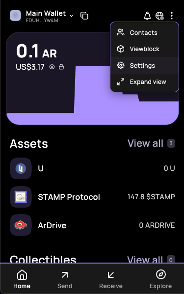
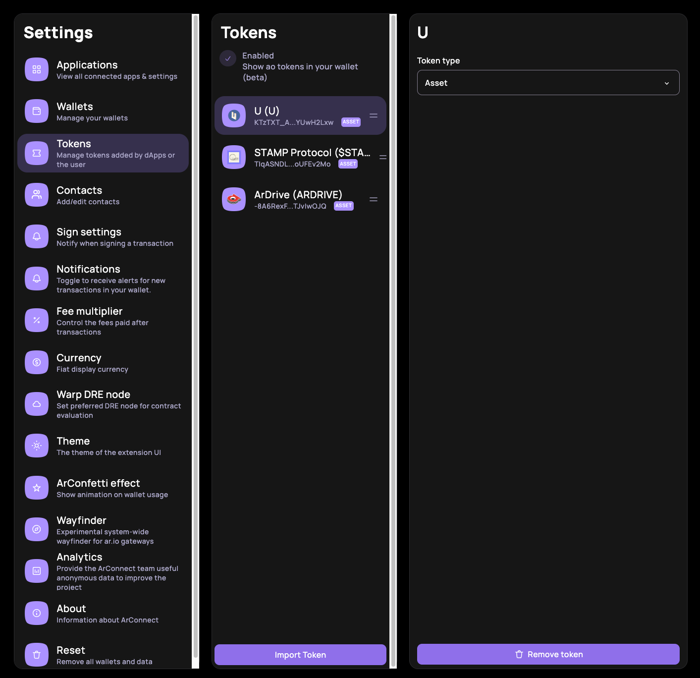
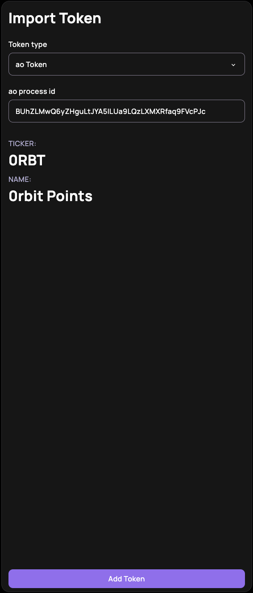
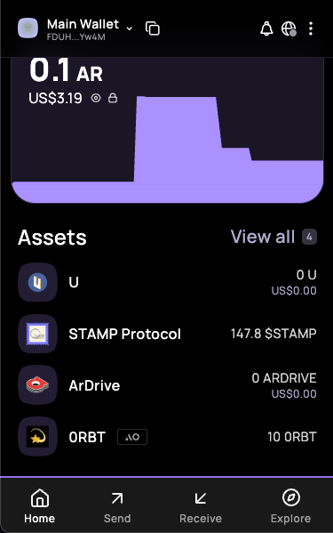

import { Steps, Callout } from 'nextra/components'

# How to add $0RBT to your Arweave Wallet?

<Steps>

### Download Arweave Wallet

You can download ArConnect from the [Chrome Web Store](https://chrome.google.com/webstore/detail/arconnect/einnioafmpimabjcddiinlhmijaionap).

### Create Your Wallet 
<Callout type="warning" emoji="⚠️">
  Make sure to save your wallet key file at a secure location.
</Callout>

### Add $0RBT to your Wallet

#### Step 1: Go to settings

#### Step 2: Go to the Tokens Tab and click on Import Token

#### Step 3: Enter the 0RBT Token ID and add token
The processId for the 0RBT is `BUhZLMwQ6yZHguLtJYA5lLUa9LQzLXMXRfaq9FVcPJc`

#### Step 4: You have successfully added the $0RBT to your wallet

</Steps>